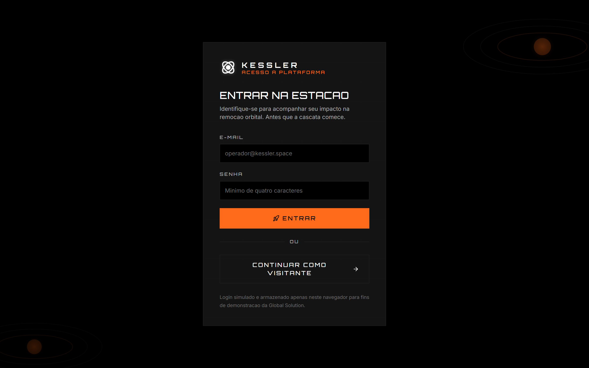
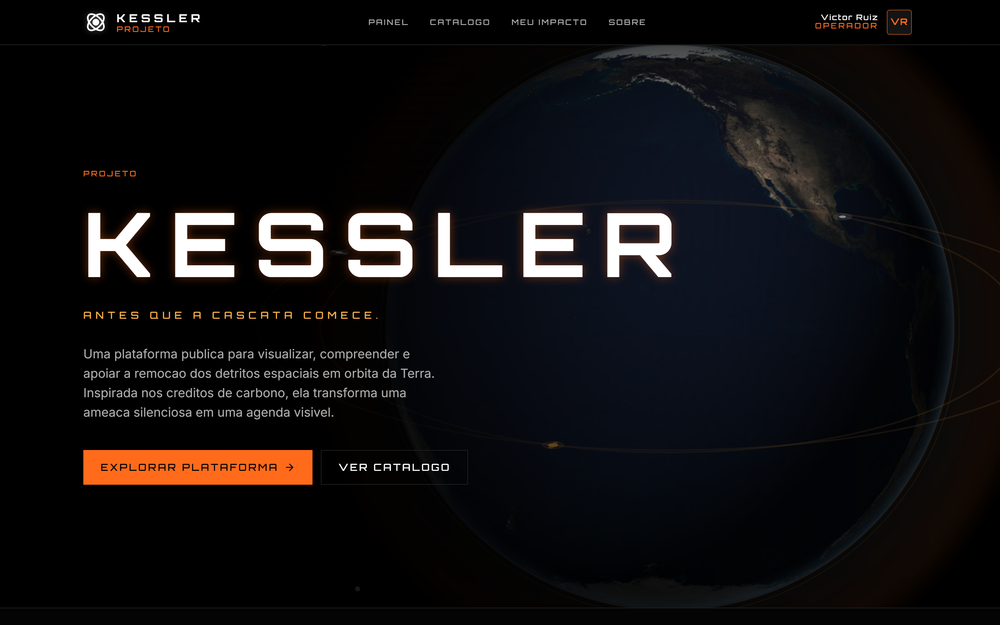
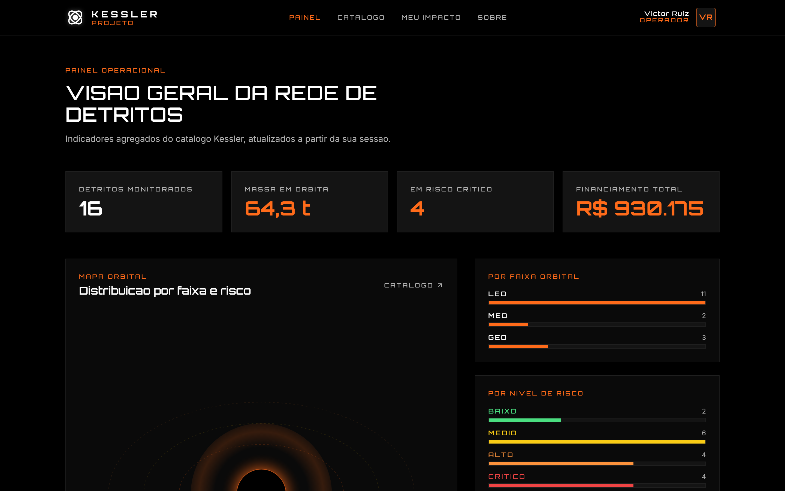
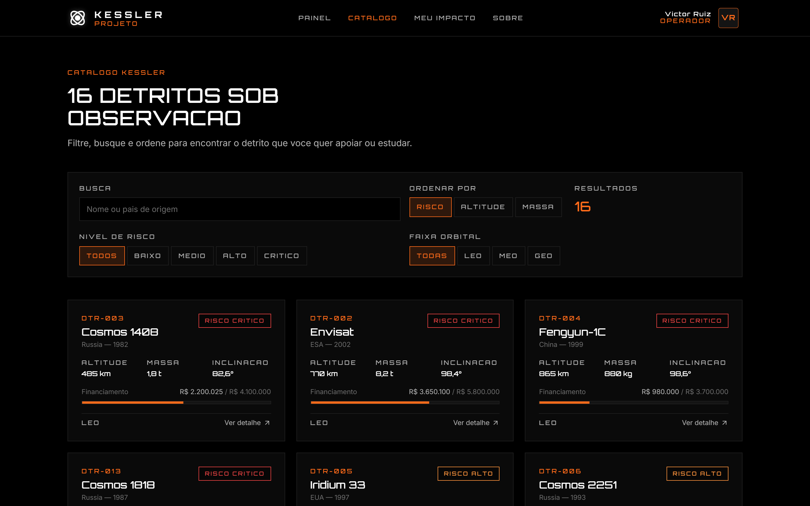
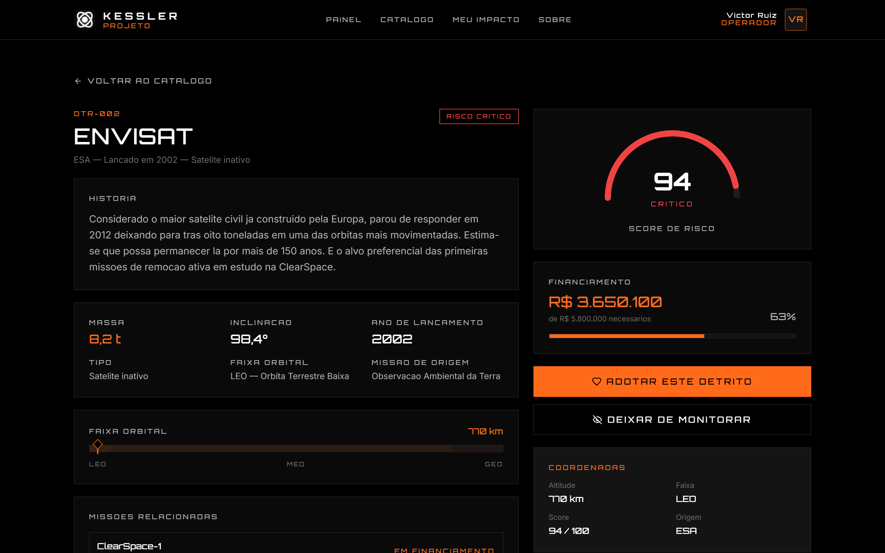
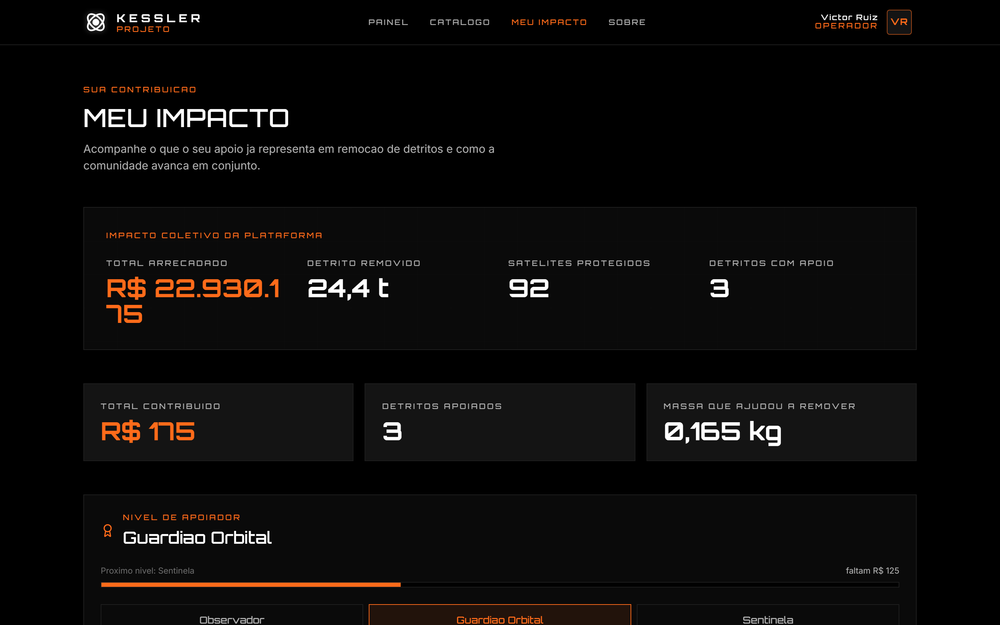
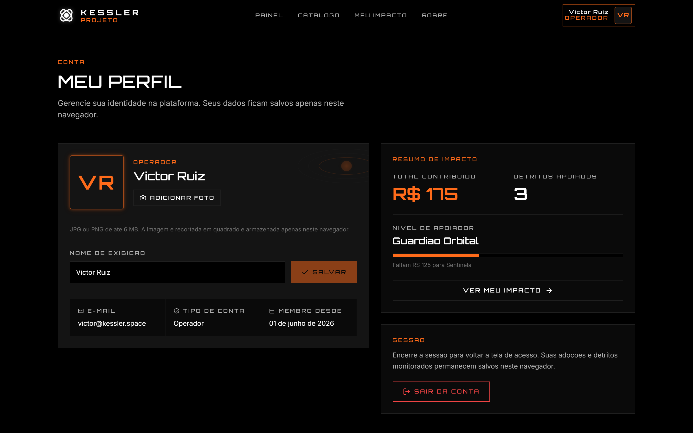
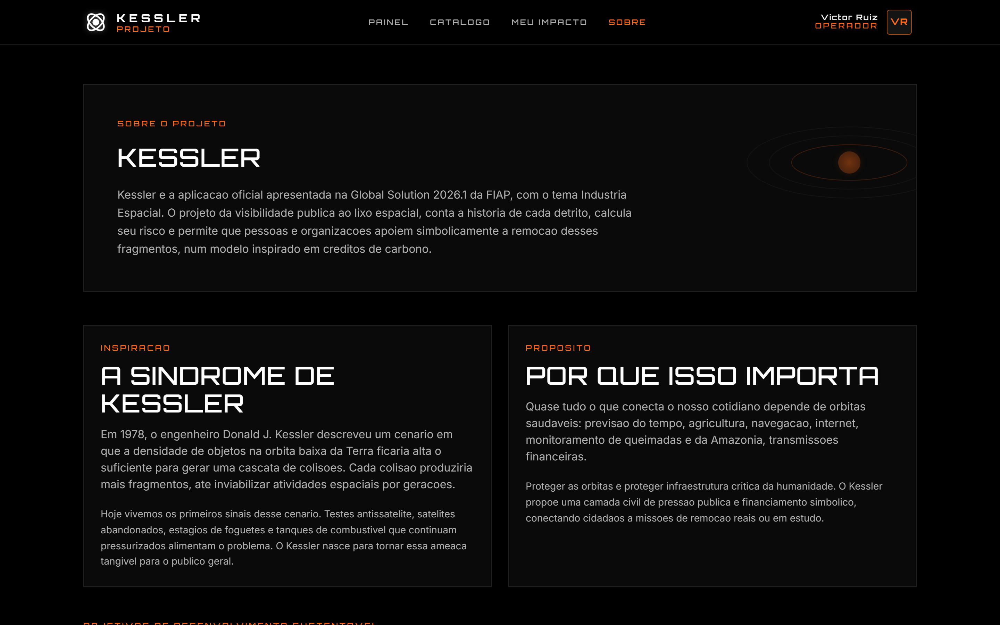

# Kessler

Plataforma de visibilidade e remocao de detritos espaciais — FIAP Global Solution 2026.1

## Sobre o projeto

Kessler e a aplicacao oficial apresentada na Global Solution 2026.1 da FIAP, no tema Industria Espacial. A plataforma da visibilidade publica ao lixo espacial em orbita da Terra, conta a historia de cada detrito catalogado, calcula seu risco e permite que pessoas e organizacoes apoiem simbolicamente missoes de remocao, num modelo inspirado em creditos de carbono.

O nome do projeto homenageia o engenheiro Donald J. Kessler, autor em 1978 do conceito da Sindrome de Kessler: uma cascata de colisoes em cadeia que pode inutilizar orbitas inteiras se a densidade de detritos continuar a crescer sem controle.

Tagline: "Antes que a cascata comece."

## Principais funcionalidades

- Landing com a Terra renderizada em tempo real: um globo tridimensional desenhado em Canvas, com textura real do planeta, rotacao continua, terminador dia e noite e detritos em orbita com pequenos choques de colisao.
- Catalogo curado com 16 detritos reais, cada um com historia autoral, dados orbitais e nivel de risco.
- Mapa orbital interativo em SVG mostrando a Terra ao centro e os aneis LEO, MEO e GEO com os detritos coloridos por risco.
- Painel com metricas agregadas de massa, risco e financiamento de remocao.
- Adocao simbolica: usuario informa nome e valor e recebe um certificado visual pronto para captura de tela.
- Monitoramento de detritos de interesse, persistido localmente.
- Pagina Meu Impacto com total contribuido, detritos apoiados e massa simbolicamente removida.
- Pagina Sobre com ODS conectados e equipe do projeto.

## Paginas

- Login — `/login`
- Landing — `/`
- Painel — `/dashboard`
- Catalogo — `/catalogo`
- Detalhe do detrito — `/detrito/:id`
- Meu Impacto — `/meu-impacto`
- Perfil — `/perfil`
- Sobre — `/sobre`

## Telas

### Login



### Landing



### Painel



### Catalogo



### Detalhe do detrito



### Meu Impacto



### Perfil



### Sobre



## Stack

- React 18 + TypeScript
- Vite
- Tailwind CSS (paleta autoral Kessler)
- React Router
- Framer Motion para microinteracoes
- lucide-react para iconografia
- Fontes Orbitron e Inter via `@fontsource`
- Persistencia local com `localStorage` encapsulado em hook proprio

Nenhuma chamada de rede e obrigatoria para a aplicacao funcionar. Tudo roda client-side.

## Como executar

```
npm install
npm run dev
```

Para gerar o build de producao:

```
npm run build
```

Para visualizar o build:

```
npm run preview
```

## Estrutura de pastas

```
kessler/
  index.html
  package.json
  tailwind.config.js
  postcss.config.js
  vite.config.ts
  tsconfig.json
  src/
    main.tsx
    App.tsx
    index.css
    types/
    data/
    lib/
    hooks/
    context/
    components/
      layout/
      ui/
      debris/
      visual/
      adoption/
    pages/
```

## Equipe

- Victor Ruiz Vieira — RM559209
- Leonardo Mortari — RM558618

Turma 3SIR — FIAP Global Solution 2026.1
